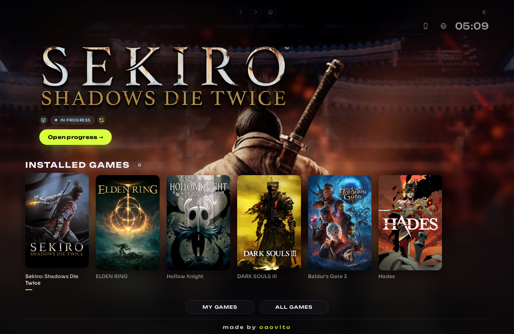
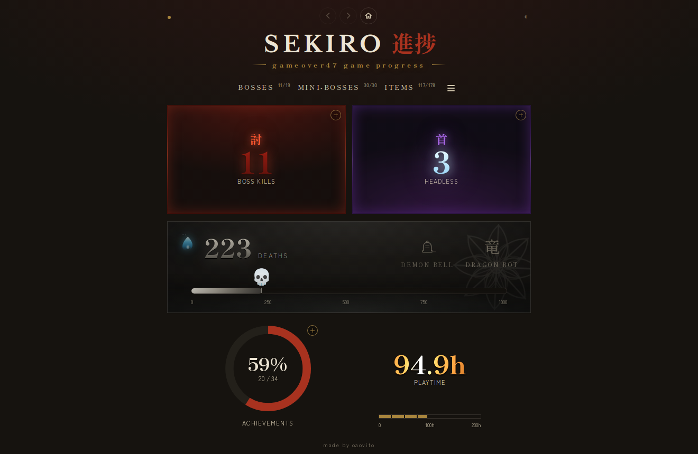
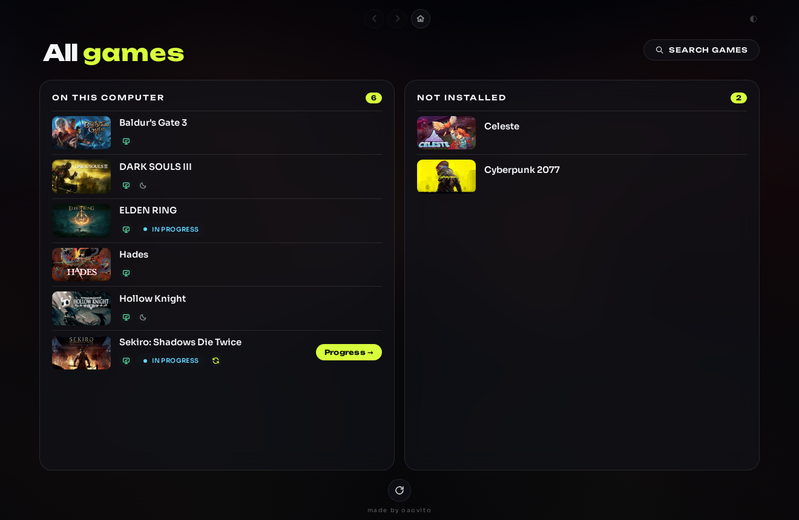
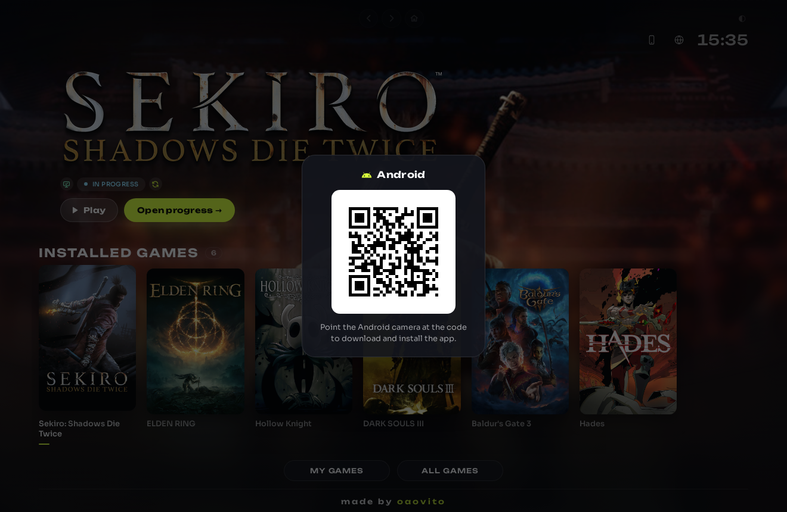
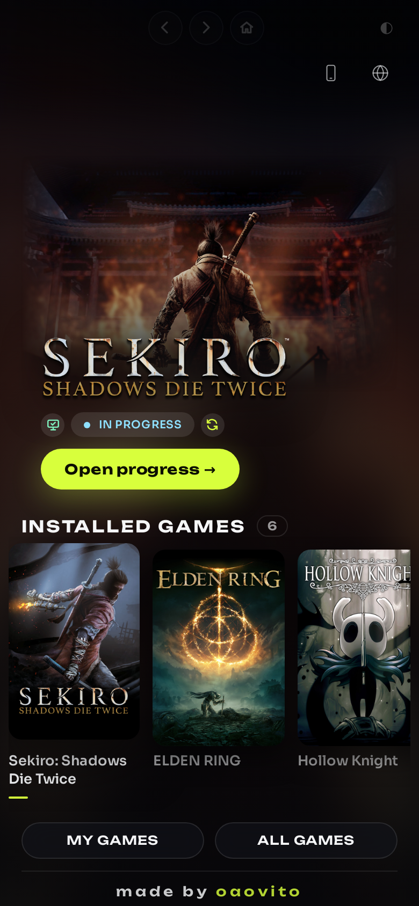
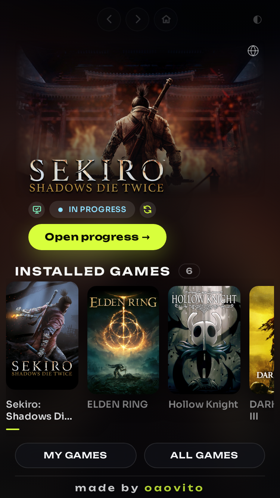
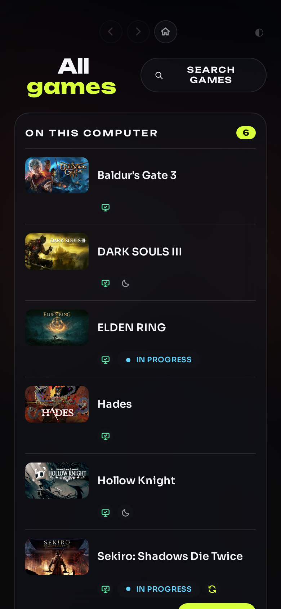
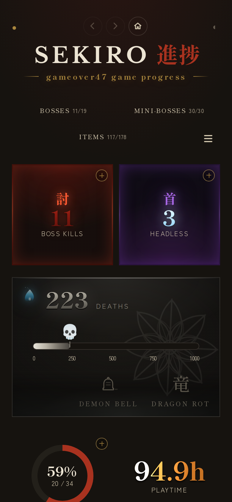
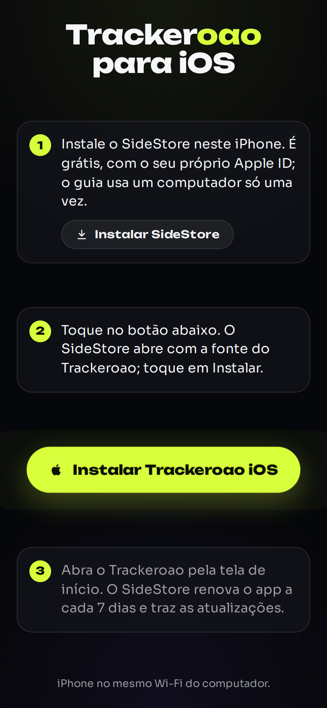

# trackeroao

Tracker de progresso para jogos de PC. O Trackeroao lê o save e a memória do
jogo, somente para leitura, e mostra o que encontrou numa página de progresso.
Hoje a leitura completa cobre **Sekiro: Shadows Die Twice**, com chefes,
mini-chefes, itens, próteses, artes de combate, conquistas, mortes e tempo de
jogo.

Além da página do Sekiro, o Trackeroao tem uma tela inicial com os jogos
instalados no computador, encontrados na Steam, na Epic, em outras lojas e no
disco. No Windows, ele roda como aplicativo próprio, com janela e ícone na
bandeja do sistema. No Android e no iOS, há aplicativos que leem o progresso a
partir do computador, pela rede local.

Princípios do projeto:

- **Somente leitura.** Nada é escrito no jogo. O save é aberto em modo de
  leitura, e o acesso à memória usa apenas `PROCESS_VM_READ` e
  `PROCESS_QUERY_INFORMATION`.
- **Sem estimativas.** Tudo o que a página mostra vem do save, do processo do
  jogo ou da Steam. Não há marcação manual; quando um dado não está disponível,
  a página indica que não sabe.
- **Sem publicação.** O progresso não sai da rede local. O serviço acessa a
  internet apenas para buscar atualizações do próprio programa, a arte dos jogos
  e catálogos de nomes, sem enviar dados do save.

## Imagens de preview

As imagens abaixo são geradas a partir das próprias telas sempre que uma
mudança visual chega à `main`, por `.github/workflows/amostras.yml`, com o
progresso de `docs/progress.json` e uma lista fixa de jogos populares.









No celular, as mesmas telas em pé:

  

 

## Requisitos

- Windows 10 ou 11, em qualquer idioma. O instalador cuida do Node.js.
- Para rodar a partir do código: Node.js 16 ou posterior. O projeto não tem
  dependências externas.
- Android 7 ou posterior, para o aplicativo de Android.
- iOS 15 ou posterior, com o SideStore, para o aplicativo de iOS.
- Celular e computador na mesma rede Wi-Fi.

## Instalação no Windows

Baixe `trackeroao-instalador.exe` da
[última release](https://github.com/oaovito/trackeroao/releases/latest) e
execute-o. O instalador:

- instala o Node.js via winget, se necessário;
- baixa o código da versão mais recente;
- registra uma tarefa agendada para o serviço, cria o atalho na área de
  trabalho e libera a porta 8777 na rede local;
- registra o Trackeroao em "Aplicativos instalados" do Windows.

Executar o instalador sobre uma instalação existente atualiza os arquivos e
preserva o progresso e as configurações. A janela do instalador e a do programa
acompanham o idioma escolhido na página ou, na falta dele, o do Windows.

O Windows SmartScreen pode exibir um aviso ao abrir o instalador, pois o
executável não tem assinatura digital de código.

### Uso

O Trackeroao abre pelo atalho da área de trabalho ou pelo ícone da bandeja. A
janela mostra a página servida localmente pelo serviço. Minimizar ou fechar a
janela pelo X apenas a esconde na bandeja; para encerrar o programa, use
"Fechar" no menu do ícone.

O menu da bandeja mostra os jogos recentes, o consumo atual do Trackeroao (CPU,
GPU e RAM) e as opções:

- **Abrir o Trackeroao**;
- **Forçar atualização**, que verifica e aplica imediatamente uma versão nova;
- **Iniciar com o Windows**, desmarcada por padrão;
- **Fechar**, que encerra a janela, o ícone e o serviço.

### Atualização automática

O serviço verifica periodicamente se há uma release nova e, quando há, aplica a
atualização em segundo plano e se reinicia. A verificação não ocorre com um jogo
aberto. Páginas abertas no computador ou no celular recarregam sozinhas após a
atualização. Para desativar esse comportamento, defina a variável de ambiente
`TRACKEROAO_SEM_ATUALIZAR`.

Instalações anteriores à v1.5.0 precisam ser reinstaladas uma vez com um
instalador recente.

### Desinstalação

Remova o Trackeroao em "Aplicativos instalados" do Windows, ou execute
`trackeroao-desinstalador.exe` na pasta da instalação. A desinstalação remove a
tarefa agendada, o atalho, a regra de firewall e os arquivos do programa, e
guarda antes uma cópia do progresso na pasta Documentos. O Node.js e o save do
jogo não são alterados.

## No celular

O progresso chega ao celular pela rede local, a partir do computador. Na janela
do Trackeroao, o ícone de celular ao lado do seletor de idioma abre o passo a
passo, com um código QR para cada plataforma.

### Android

O aplicativo `trackeroao.apk` está disponível na página da release e também
pode ser baixado diretamente do computador, pelo código QR do botão "Android".
O aplicativo encontra o computador pelo nome `trackeroao.local` (mDNS), guarda
uma cópia da última leitura para uso fora de casa e solicita apenas permissões
de rede e Wi-Fi.

O `.apk` é assinado com uma chave gerada a cada build. Quando uma versão nova do
aplicativo precisar ser instalada, o Android pode exigir que a anterior seja
removida antes.

### iOS

O aplicativo de iOS é instalado pelo [SideStore](https://sidestore.io), que é
gratuito e assina os aplicativos com o Apple ID de quem instala, sem conta paga
de desenvolvedor.

1. Instale o SideStore seguindo o guia oficial (é necessário um computador
   apenas nessa etapa).
2. No iPhone, leia o código QR do botão "iOS" na janela do Trackeroao.
3. Na página aberta, toque no botão que adiciona a fonte do Trackeroao ao
   SideStore e instale o aplicativo.

A fonte é `docs/celular/altstore/fonte.json`, no formato do AltStore, e é
atualizada a cada release. Com um Apple ID gratuito, a assinatura vale por sete
dias; o SideStore renova o aplicativo automaticamente e também instala as
versões novas.

## Quanto a aplicação consome

O Trackeroao foi projetado para permanecer ligado sem impacto perceptível, com
um consumo comparável ao de um aplicativo leve de uso contínuo.

- **Com o jogo fechado:** um único processo `node`, com cerca de 50 a 60 MB de
  memória e uso de CPU praticamente nulo. O serviço verifica a cada cinco
  segundos se o jogo está aberto e responde às páginas abertas na rede local.
- **Com a janela aberta:** somam-se a janela e os processos do WebView2, com
  consumo semelhante ao de uma página aberta num navegador. Quando a janela é
  escondida, as animações param e a memória é devolvida ao sistema.
- **Com o jogo aberto:** o save é lido a cada gravação feita pelo jogo, e a
  memória do jogo é consultada junto com cada leitura. O resultado é gravado em
  `progress.json`, sem nenhum envio para fora do computador.

Cada release passa por um orçamento de recursos na integração contínua: num
Windows limpo, com a janela aberta e parada, o Trackeroao inteiro (serviço,
janela, ícone e processos do WebView2) é medido por vinte segundos, e a release
não é publicada se ultrapassar **2% de CPU** ou **400 MB de memória privada**.

## Dados lidos do save

| Item | Origem | Confiança |
|---|---|---|
| Prayer Beads (coletadas) | save | alta |
| Prayer Necklaces (1–10) | save | alta |
| Gourd Seeds na bolsa | save | alta |
| Os 9 materiais de prótese | save | média |
| Chefes principais | save (Memories) | alta |
| Ferramentas protéticas | save | alta (base) / média (melhorias) |
| Artes de combate | save | alta (básicas) / média (avançadas) |
| Mini-chefes | save (event flags) | alta |
| Headless | save (Spiritfall) | alta |
| Sino Demoníaco e Dragonrot | save (itens) | alta |
| Conquistas | save, conferido com a Steam | alta |
| Mortes | memória do jogo | alta |

O formato `.sl2` não é documentado pela FromSoftware; a leitura é resultado de
engenharia reversa. Os IDs e offsets ficam em `sync/offsets.json`, cada um com
um campo `confidence`. Uma atualização do jogo pode alterar o formato; nesse
caso, o primeiro passo é executar `npm run selftest`.

Quando o save não está disponível, a página mostra `—` em vez de zero e indica
o motivo no topo.

## A Steam é opcional

O Trackeroao funciona sem a Steam. Quando ela está instalada, é usada como
fonte complementar:

- **Nome do jogador:** pode ser definido na própria página; sem isso, é usado o
  nome público da conta Steam associada ao save.
- **Tempo de jogo:** a Steam fornece o tempo de relógio; sem ela, é usado o
  tempo interno registrado no save.
- **Conquistas:** são deduzidas do save e, quando a Steam existe, conferidas com
  o cache local dela. A página indica quando as duas fontes divergem.

## Idiomas

A página está disponível em doze idiomas: inglês, português do Brasil,
espanhol, francês, alemão, italiano, russo, polonês, turco, japonês, coreano e
chinês simplificado. Por padrão, segue o idioma do sistema; a escolha feita no
seletor da tela inicial vale para a página, o menu da bandeja e o instalador.
Nomes de jogos, chefes, itens e conquistas aparecem como o jogo os escreve.

## Executando a partir do código

```powershell
git clone https://github.com/oaovito/trackeroao.git
cd trackeroao
.\windows\install-sync-service.ps1
```

O script registra a tarefa agendada sem exigir administrador. Para executar
manualmente, pare o serviço e use:

```bash
npm start            # serviço completo, em modo manual
npm run selftest     # suíte de testes
npm run sync         # lê o save uma vez e grava progress.json
npm run serve        # apenas o servidor
npm run deaths       # contagem de mortes lida da memória
npm run discover     # descoberta de offsets por comparação
npm run jogos        # varre os jogos instalados
```

O servidor escuta na porta 8777 e anuncia o nome `trackeroao.local` na rede
local. Se o celular não conseguir acessar a página, execute
`.\windows\liberar-porta.ps1` como administrador para liberar a porta no
firewall. O log do serviço fica em `sync/trackeroao.log`.

## Onde ele procura o save

- **Windows:** `%APPDATA%\Sekiro\<steamid>\S0000.sl2`.
- **Linux e Steam Deck:** no prefixo do Proton,
  `~/.local/share/Steam/steamapps/compatdata/814380/pfx/drive_c/users/steamuser/AppData/Roaming/Sekiro/<steamid>/S0000.sl2`,
  além de `~/.steam/steam`, da instalação via Flatpak e de prefixos Wine comuns.

Com mais de uma conta Steam, é usada a pasta modificada mais recentemente. O
slot ativo é identificado observando qual bloco muda quando o jogo salva; para
fixá-lo, defina `"slot": N` em `sync/offsets.json`.

## Problemas comuns: não achou o save

Quando a mensagem é **"não achou o save"**, execute `npm run selftest`. Se o
jogo nunca foi aberto neste computador, a pasta do save ainda não existe.

Quando a página mostra **"sem sincronizar"**, ela não está se comunicando com o
serviço. Verifique se o celular está na mesma rede Wi-Fi, se o computador está
ligado, se o Trackeroao não foi encerrado pelo menu da bandeja e se o serviço
está ativo (`Get-ScheduledTask TrackeroaoSync` e `sync/trackeroao.log`). A
página não funciona aberta diretamente por `file://`.

Quando o **iPhone não encontra `trackeroao.local`**, os aparelhos geralmente
estão em redes diferentes (por exemplo, a rede de convidados do roteador) ou a
porta 8777 está bloqueada no firewall.

Quando os **números parecem errados**, verifique o slot escolhido e, se
necessário, fixe-o em `sync/offsets.json`.

## Privacidade

O progresso fica no computador e na rede local. Arquivos com dados da máquina,
como o `progress.json` completo, logs, estados e cópias do save, são gerados em
tempo de execução e ficam fora do git. O aplicativo de Android solicita apenas
permissões de rede, e os aplicativos de celular apenas leem dados do computador.

## Arquivos

```
trackeroao/
  .github/
    releases/           notas de cada versão (vX.Y.Z.md)
    workflows/          release, catálogo de jogos, iOS e imagens de preview
  .gitignore
  README.md
  docs/
    amostras/           imagens de preview deste README
    app/                ícones do aplicativo
    celular/
      android/          aplicativo de Android
      ios/              aplicativo de iOS (Swift)
      altstore/         fonte.json, lida pelo SideStore
    icones/             arte dos chefes, Headless e conquistas
  package.json          scripts npm (sem dependências)
  sync/
    main.js             serviço: detecção do jogo, leitura do save e servidor
    parse.js            monta o progress.json
    sl2.js              leitura do container do save
    offsets.json        IDs e offsets
    mem.ps1             leitor de memória (somente leitura)
    serve.js            servidor local
    atualizar.js        atualização automática
    selftest.js         suíte de testes
  trackeroao.html       a página
  windows/
    instalador/         scripts que geram o instalador e a janela do Windows
    install-sync-service.ps1
    uninstall-sync-service.ps1
    liberar-porta.ps1
    run.bat
```

## Releases

Para publicar uma versão, adicione o arquivo de notas `.github/releases/vX.Y.Z.md`
à `main`. O workflow `.github/workflows/release.yml` gera o instalador e o
aplicativo de Android, testa a instalação num Windows limpo, verifica o
orçamento de recursos e publica a release `vX.Y.Z` com `trackeroao-instalador.exe`
e `trackeroao.apk`. O título da release é o nome do aplicativo seguido da
versão, como "Trackeroao 1.9.0".

O catálogo de jogos é atualizado diariamente por `.github/workflows/catalogo.yml`,
que também gera uma nova release quando a última tem quinze dias ou mais.
